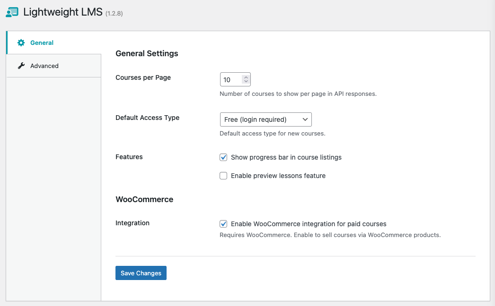

# LW LMS

> **!! This plugin is under active development and is not recommended for production use. !!**

Lightweight LMS plugin for WordPress - courses, lessons, and progress tracking without the bloat.



## Requirements

- PHP 8.1+
- WordPress 6.0+
- WooCommerce (optional, for paid courses)
- WooCommerce Subscriptions (optional, for subscription-based access)

## Features

- **Courses & Lessons** - Custom post types with Gutenberg support
- **Sections** - Organize lessons into sections with drag-and-drop ordering
- **Access Control** - Open, free (login required), or paid (WooCommerce)
- **Progress Tracking** - Per-user lesson completion and course progress percentage
- **Video Support** - YouTube, Vimeo, Wistia, self-hosted (auto-detect)
- **Attachments** - File downloads for courses and lessons
- **REST API** - Full API at `/wp-json/lms/v1/` for headless implementations
- **WooCommerce** - Link courses to products and subscriptions

## Installation

```bash
composer require lwplugins/lw-lms
```

Or upload the `lw-lms` folder to `/wp-content/plugins/` and activate.

## REST API Endpoints

| Method | Endpoint | Description |
|--------|----------|-------------|
| GET | `/lms/v1/courses` | List courses |
| GET | `/lms/v1/courses/{id}` | Get single course |
| GET | `/lms/v1/lessons/{id}` | Get single lesson |
| POST | `/lms/v1/progress` | Update lesson progress |
| GET | `/lms/v1/progress` | Get user progress |
| GET | `/lms/v1/download/{id}` | Download attachment |

## Development

```bash
composer install
composer phpcs     # Code style check
composer phpcbf    # Auto-fix
```

## License

GPL-2.0-or-later
